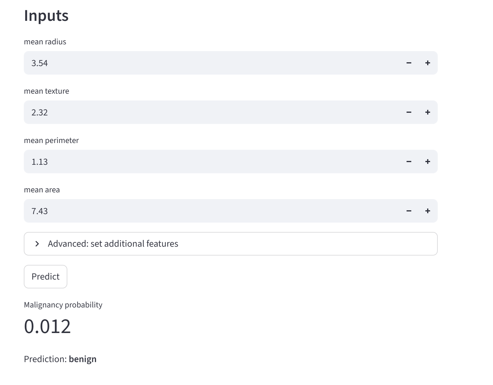

# Breast Cancer Risk Stratification Project

## Problem description
This project trains a machine learning model to classify breast tumors as **malignant** or **benign**
based on features computed from FNA images. The goal is to provide a deployable **risk estimation service** that returns a probability of malignancy and a predicted class.

**Use case**: A downstream application could call this service to get a malignancy risk score from
measured features and support decision-making such as screening triage.

## Data
Data is from **Wisconsin Breast Cancer Diagnostic** dataset that ships with `scikit-learn`.

## How to run

### 1) Create environment & install deps
```bash
python -m venv .venv
source .venv/bin/activate      # Linux/Mac
# .venv\Scripts\activate       # Windows PowerShell

pip install -r requirements.txt

### 2) Train the model

```bash
python train.py

This creates model.bin

### 3) Run the prediction service locally

```bash
python predict.py

Then open another window in powershell and use the following commands:

```bash
$body = @{
  "mean radius"    = 14.2
  "mean texture"   = 20.1
  "mean perimeter" = 92.0
  "mean area"      = 650.0
} | ConvertTo-Json


```bash
Invoke-RestMethod `
  -Uri "http://127.0.0.1:9696/predict" `
  -Method Post `
  -ContentType "application/json" `
  -Body $body

If you don’t provide all features, missing ones will be imputed by training-set medians.

An example such as this one will be printed to the terminal:

malignancy_probability model prediction
---------------------- ----- ----------
  0.012412354230902685 rf    benign


### 4) Docker

Open Docker on the background and then on the terminal, build:

```bash
docker build -t bc-risk-service .

Then run:

```bash
docker run -it --rm -p 9696:9696 bc-risk-service

### 5) Deployment

In addition to running the model locally and via Docker, this project is deployed using a Streamlit web UI to provide an interface for predictions.

#### Streamlit UI

The Streamlit application loads the trained model (`model.bin`) and allows users to input
feature values and receive a malignancy risk prediction.

#### Run Streamlit locally

```bash
streamlit run app.py

Then, a browser will be opened which you can try various values to test the model.



##### Project structure

notebook.ipynb: EDA, feature analysis, model comparisons, hyperparameter tuning

train.py: trains the final model and saves it to model.bin

predict.py: loads model.bin and serves predictions via Flask

requirements.txt: dependencies

Dockerfile: container setup

